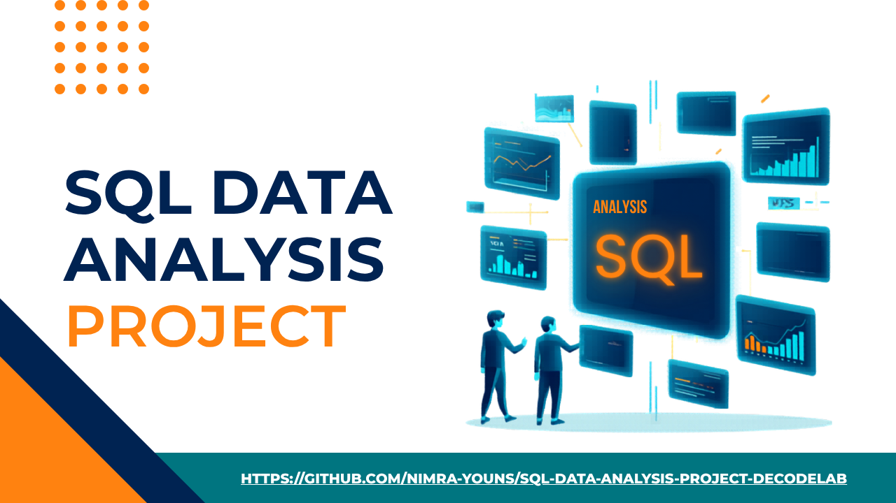

<p align="center">
  
</p>
# SQL Data Analysis Project

## 📊 Project Overview

This project demonstrates SQL fundamentals through practical data analysis queries. The dataset contains e-commerce order data with customer information, products, payment methods, and referral sources.

**Project Goal:** Use SQL queries to extract insights from a dataset using SELECT queries, filtering, grouping, and aggregations.

## 📋 Key Skills Demonstrated

- ✅ SQL fundamentals and query writing
- ✅ Data filtering with WHERE clauses
- ✅ Data sorting with ORDER BY
- ✅ Data grouping with GROUP BY
- ✅ Aggregate functions (COUNT, SUM)
- ✅ Common Table Expressions (CTEs)
- ✅ INNER JOIN operations
- ✅ Data type conversions with CAST

## 📁 Project Structure

```
SQL-Data-Analysis/
├── README.md
├── Dataset_for_Data_Analytics.xlsx
├── queries/
│   └── analysis_queries.sql
└── docs/
    └── QUERY_DOCUMENTATION.md
```

## 🗂️ Dataset Overview

**Table Name:** Dataset

**Columns:**
- `OrderID` - Unique order identifier
- `CustomerID` - Customer identifier
- `Product` - Product name/category
- `Quantity` - Order quantity
- `TotalPrice` - Total order price
- `PaymentMethod` - Payment type
- `ReferralSource` - How customer found the business (e.g., Google, Social Media)

## 🔍 Queries Included

### 1. **Overall Sales Summary**
Returns total number of orders and total revenue across the entire dataset.

### 2. **Revenue by Product**
Analyzes which products generate the most revenue, ranked in descending order.

### 3. **Top 5 Customers**
Identifies the top 5 customers by total revenue spent.

### 4. **Revenue by Payment Method**
Breaks down total orders and revenue by payment method.

### 5. **High-Value Orders from Google**
Filters orders from Google referral source with quantity > 4, sorted by price.

### 6. **Referral Source Analysis**
Groups referral sources with more than 10 orders.

### 7. **Top 5 Most Expensive Orders (with CTE)**
Uses a Common Table Expression to fetch detailed information about the 5 highest-priced orders.

## 🚀 Getting Started

### Prerequisites
- SQL Server (or compatible SQL database)
- The provided Excel dataset (`Dataset_for_Data_Analytics.xlsx`)

### Setup Instructions

1. **Import the Dataset:**
   - Create a new SQL Server database named `Project3`
   - Import `Dataset_for_Data_Analytics.xlsx` into a table named `Dataset`

2. **Run Queries:**
   - Open `queries/analysis_queries.sql`
   - Execute queries individually or all at once
   - View results to analyze the data

3. **Modify as Needed:**
   - Adjust WHERE conditions to filter different data
   - Modify aggregations for different analysis
   - Extend queries for additional insights

## 📊 Key Insights from Queries

- **Total Orders & Revenue:** Get a bird's-eye view of business performance
- **Product Performance:** Identify bestselling and most profitable products
- **Customer Value:** Recognize high-value customers for retention strategies
- **Payment Trends:** Understand which payment methods are most popular
- **Referral Effectiveness:** Measure which referral sources drive high-value orders
- **Marketing ROI:** Analyze Google referral source effectiveness

## 💡 Learning Objectives

By completing this project, you will understand:
- How to write efficient SELECT queries
- Using WHERE clauses for data filtering
- Grouping data and applying aggregate functions
- Sorting results for meaningful insights
- Using CTEs for complex queries
- Joining tables for comprehensive analysis

## 📝 License

This project is for educational purposes.

## 🤝 Contributing

Feel free to fork this repository and add your own analysis queries or improvements.

---

**Author:** Nimra-Youns
**Last Updated:** 18-May-2026  
**Status:** Completed
